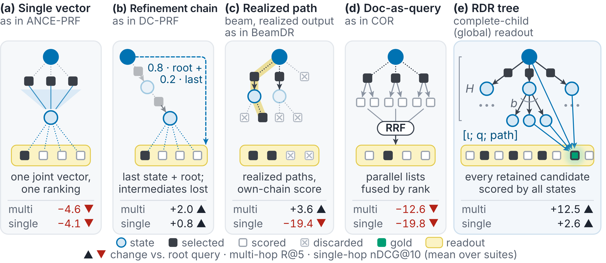

<h1 align="center">Recursive Dense Retrieval</h1>

<p align="center">
  One instruction-conditioned encoder, recursive search, and a global readout,<br>
  for single-hop and multi-hop retrieval.
</p>

<p align="center">
  <a href="https://anonymous.4open.science/w/Recursive-Dense-Retrieval/">Website &amp; docs</a> ·
  <a href="https://anonymous.4open.science/w/Recursive-Dense-Retrieval/docs/quickstart/">Quickstart</a> ·
  <a href="https://anonymous.4open.science/w/Recursive-Dense-Retrieval/combinations/">Combinations</a> ·
  <a href="reproduce/">Reproduce the paper</a>
</p>

---

RDR is a dense retriever that searches recursively. An instruction, the query and the documents observed so far
form a **state**. The encoder maps each state to one query vector, which searches a fixed document index. Each
retrieved document can be appended to the state and encoded again. Repeating this builds a retrieval tree. The
**global readout** then scores every retained candidate with all states of the tree.

Because the instruction is part of the state, one encoder does both jobs. With the *recovery* instruction it
refines a single-hop query. With the *continuation* instruction it follows a multi-hop evidence chain.

The package `rdr` implements this operator. Dense retrieval, pseudo-relevance feedback, refinement chains, beam
retrieval and document-as-query expansion are all instances of it:

<p align="center">
  
</p>

*Search and readout strategies under the same encoder (Figure 2 of the paper):*

- *(a) Pseudo-relevance feedback encodes observations jointly into one query vector.*
- *(b) As in DC-PRF, a refinement chain reads out its last state, interpolated with the root.*
- *(c) Beam retrievers return realized paths, each document scored by its own chain.*
- *(d) Promoting retrieved documents to queries fuses parallel lists by rank.*
- *(e) RDR scores every retained candidate with all learned states.*

*The numbers are the change over the root query in multi-hop Recall@5 and single-hop nDCG@10.*

## Installation

```bash
pip install .    # in the downloaded repository
# benchmark loaders for reproduce/:  pip install ".[eval]"
```

- **Requirements.** Python ≥ 3.9, PyTorch ≥ 2.1, sentence-transformers 3.x–5.x and transformers ≥ 4.51.
- **Model.** RDR-8B (weights not included in this anonymized repository) is fine-tuned from Qwen3-Embedding-8B. It
  loads as a sentence-transformers model (last-token pooling, normalized, 4096 dimensions) and needs about 16 GB
  of GPU memory in bf16.
- **Hardware.** Everything also runs on CPU in fp32.

## Quickstart

```python
from rdr import RecursiveRetriever

retriever = RecursiveRetriever("RDR-8B")        # multi-hop prompts, TreeSearch(4, 3), GlobalReadout()
index = retriever.build_index({
    "d1": "The novel Harbor Lights was written by Mara Voss.",
    "d2": "Mara Voss was born in Linz, Austria, in 1961.",
    "d3": "Linz lies on the Danube, the second-longest river in Europe.",
})
hits = retriever.search("Which river flows through the birthplace of the author of Harbor Lights?", index, top_k=3)
# [{"corpus_id": ..., "score": ..., "index": ...}, ...]  (semantic_search-style hits)
```

**Change the search, keep the readout.** The global readout is the default for every search. Realized outputs,
such as a beam's chains, must be requested explicitly:

```python
from rdr import ChainSearch, BeamSearch, ProbabilityChain, recovery_fusion

retriever.search(queries, index, search=ChainSearch(depth=4))                                  # 4 states
retriever.search(queries, index, search=BeamSearch(width=5))                                   # beam, global readout
retriever.search(queries, index, search=BeamSearch(width=5), readout=ProbabilityChain())       # BeamDR's output
retriever.search(queries, index, readout=recovery_fusion())                                    # + recovery view
```

**Single-hop.** Use the recovery instruction at every context level, and the benchmark's own root instruction:

```python
from rdr import RecursiveRetriever, instructions

retriever = RecursiveRetriever("RDR-8B", prompts="single-hop")
hits = retriever.search(queries, index, instruction=instructions.root_for("nanobeir", "NanoSciFact"))
```

**Two GPUs.** Keep the encoder and the exact fp16 index search on separate devices. Query batches overlap:
while one batch is encoded, the next is searched.

```python
retriever = RecursiveRetriever("RDR-8B", encode_device="cuda:0", index_device="cuda:1")
```

## What is in the package

| | |
|---|---|
| **Search strategies** (which states form) | `TreeSearch` (RDR(H, b), default H=4, b=3), `ChainSearch`, `BreadthSearch` (RDR(2, m)), `BeamSearch` (as in MDR/BeamDR), `DocAsQuerySearch` (as in COR), `JointFeedback` (as in ANCE-PRF), `DenseSearch` |
| **Readouts** (how scores become a ranking) | `GlobalReadout` (Eq. 2, default); realized: `PathProduct`, `ProbabilityChain`, `SequenceSum`, `ChainOrder`, `TerminalState`; fusion: `RRF`, `PostOrderRRF`, `Borda`, `CombMNZ`, `MaxOverStates`; model-based: `RootInterpolation`, `Assembly`, `StateReadout`; views: `recovery_fusion`, `ZAgreement` |
| **Prompts** | presets `"multi-hop"`, `"single-hop"`, `"single-hop-continuation"`, `"bright-pro"`; instructions by key (`rdr.instructions`); fully custom `PromptConfig` |
| **Execution** | level-synchronous batching, separate encode and index devices, in-flight query batches, CPU fallback, exact reproduction mode |
| **Evaluation** | Recall@k over gold groups, nDCG@k, α-nDCG@k; loaders for BRIGHT, NanoBEIR, CoIR, ToolRet, TopiOCQA, MuSiQue, BrowseComp+, FanOutQA, FRAMES |

Every class and parameter is documented in the [API reference](https://anonymous.4open.science/w/Recursive-Dense-Retrieval/docs/api/).

## Results

**Multi-hop retrieval**, Recall@5 (Table 1 of the paper):

| Model / configuration | MuSiQue | BrowseComp+ | FanOutQA | FRAMES |
|---|---:|---:|---:|---:|
| Qwen3-Embedding-8B, q₀ | 63.16 | 14.70 | 26.79 | 67.80 |
| GRITHopper-7B, recursive | 78.55 | 12.98 | 31.96 | 74.08 |
| RDR(1, 0) (q₀) | 58.51 | 16.87 | 28.63 | 66.77 |
| **RDR(4, 3)** | **80.14** | **25.28** | **37.78** | **77.41** |
| + recovery (z-agreement) | 81.45 | 25.28 | 40.66 | 77.89 |
| + Assembly | 79.62 | 23.63 | 49.29 | 79.20 |

**Single-hop retrieval**, nDCG@10 (Table 2 of the paper; BRIGHT-Pro reports α-nDCG@10):

| Model / configuration | BRIGHT | NanoBEIR | ToolRet | CoIR | TopiOCQA | Avg. | BRIGHT-Pro |
|---|---:|---:|---:|---:|---:|---:|---:|
| Qwen3-Embedding-8B | 23.17 | 71.74 | 44.72 | 79.93 | 59.40 | 55.79 | 43.76 |
| BGE-Reasoner-8B | 36.97 | 60.90 | 42.26 | 65.32 | 41.85 | 49.46 | 61.82 |
| RDR(1, 0) (q₀, no context) | 29.02 | 66.55 | 46.45 | 78.77 | 63.37 | 56.83 | 55.92 |
| **RDR(4, 3)** | 30.84 | 68.13 | 48.04 | 78.88 | 70.79 | **59.34** | 61.13 |

**Search × readout** under one encoder (Table 3). Multi-hop is mean Recall@5 over four suites; single-hop is
mean nDCG@10 over five suites:

| Search / readout | Multi-hop | Single-hop |
|---|---:|---:|
| Root query | 42.70 | 56.78 |
| as in ANCE-PRF: joint feedback / single vector | 38.15 | 52.71 |
| as in DC-PRF: chain / last state, root-interpolated | 44.68 | 57.57 |
| as in BeamDR: beam (W=5) / probability chain | 46.30 | n/a |
| as in COR: document-as-query tree / rank fusion | 30.08 | n/a |
| chain / global readout | 53.91 | 57.95 |
| beam (W=13) / global readout | 53.88 | 59.60 |
| **RDR: learned tree / global readout** | **55.15** | **59.34** |

The [configurator](https://anonymous.4open.science/w/Recursive-Dense-Retrieval/combinations/) lists every measured combination
per suite.

## Reproducing the paper

[`reproduce/`](reproduce/) holds one configuration per table, a runner that reads each saved traversal with every
readout of that table, and an aggregator that compares the results with the paper. See
[`reproduce/README.md`](reproduce/README.md) for data preparation and the exact batching mode.

## Citation

This repository accompanies an anonymous submission under double-blind review. Citation information will be added after the review period.

## License

Apache-2.0 (see [LICENSE](LICENSE)). RDR-8B is fine-tuned from Qwen3-Embedding-8B (Apache-2.0).
